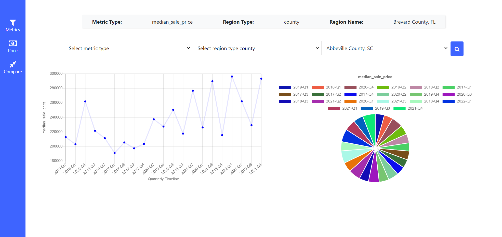
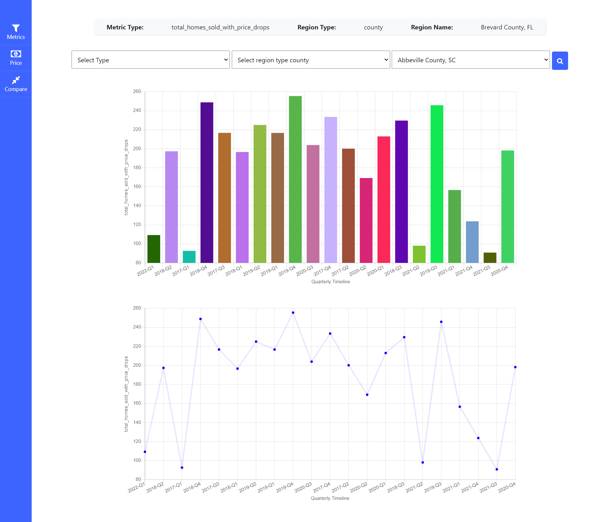
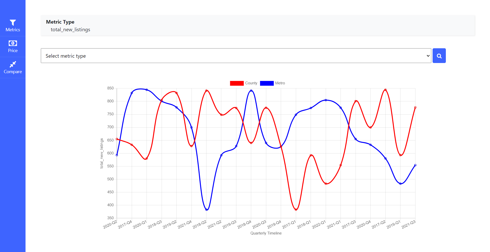
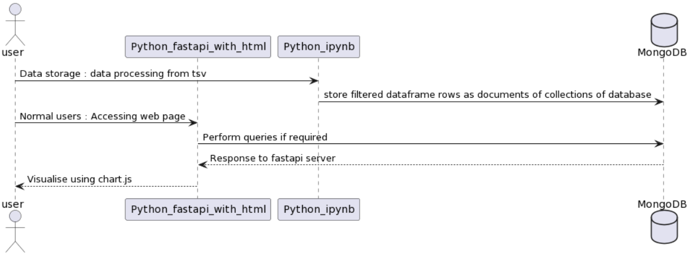

## Question 3 : US housing market dynamics
<br>
The project is done with following technologies
<br><br>

```
Cloud Platform - Microsoft Azure
server - FastAPI
Frontend - HTML + Chart.js + Bootstrap
Domain   - Namecheap.com
Database - MongoDB Atlas
```

## Project links
<br>

Domain Registered with Namecheap.com pointing to Microsoft Azure VM public ip


<a link="http://sanjay-zerodown-task.me/">http://sanjay-zerodown-task.me/

Server Access

<a link="http://20.185.234.212:8000/">http://20.185.234.212:8000/

## Folder Structure

```
US housing market dynamic
|__notebook
|   |_marketdynamics.ipynb(data processing notebook file)
|
|__webapplication
    |_html(static pages for frontend)
    |_routes(route files for fastapi)
    |_main.py(driver code for server)
```

## Screenshots of Interface

First page for metrics like median_sale_price & Quarterly values for different values 



Price page for metrics like & Quarterly values for different values



comparison for each metric in case of county & metro




# Video demo


<a href="https://drive.google.com/file/d/1nP7RMNpO5X-N_WfGcbDclE9brd0SsH0j/view?usp=sharing">
--> click here for Interface demo </a>

<br>

## The sequence diagram for interface

<hr>
<br>



<br>

## Question 2 : Natural Hazards


shapefile loading done with creating pandas dataframe


